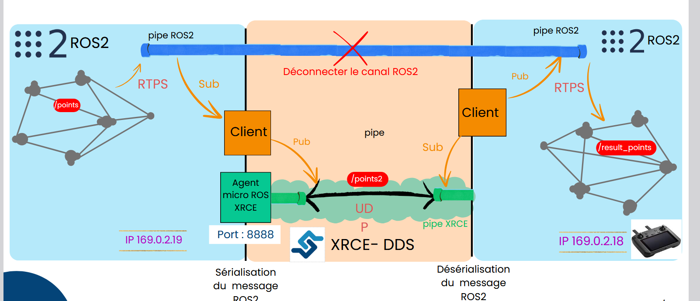

# ROS2 Micro XRCE-DDS Communication

This project demonstrates how to integrate **micro-ROS with ROS 2 using Micro XRCE-DDS** to enable communication between resource-constrained embedded systems and the ROS2 ecosystem.

The goal is to replace the traditional ROS2 DDS communication between machines with a **lightweight XRCE-DDS communication layer**, allowing microcontrollers or embedded devices to interact with ROS2 nodes efficiently.

---

## Architecture

The system uses the **XRCE-DDS client–agent architecture**.

- ROS2 nodes communicate using DDS
- micro-ROS clients run on embedded systems
- the **XRCE agent** acts as a bridge between micro-ROS and ROS2

### System Architecture

In this architecture:

- ROS2 nodes publish and subscribe to topics
- micro-ROS clients communicate through the **XRCE-DDS protocol**
- the **micro-ROS agent** converts XRCE messages into ROS2 DDS messages

The communication uses **UDP transport** and message serialization to reduce bandwidth usage.

---

## Features

- Integration of **ROS2 and micro-ROS**
- Communication using **Micro XRCE-DDS**
- UDP-based transport layer
- Ping / Pong micro-ROS communication example
- Transmission of complex ROS messages (PointCloud2)
- Multi-machine communication setup

---

## Requirements

- Ubuntu 22.04
- ROS2 Iron
- micro-ROS
- Micro XRCE-DDS

---

## Project Documentation

Detailed documentation is available here:

- [XRCE communication tests](Readme_test_xrce.md)
- [Installation verification](Readme_verif_install.md)

---

## Additional Resources

Architecture presentation:

`docs/presentation_micro_ros_xrce.pdf`

---

## Author

Guillaume Poret
